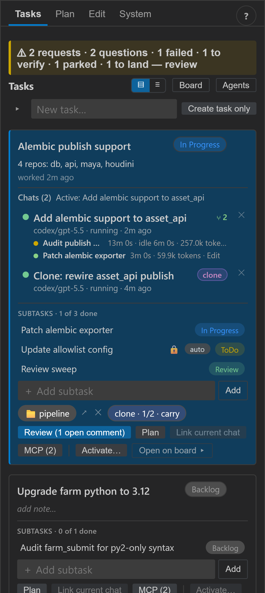
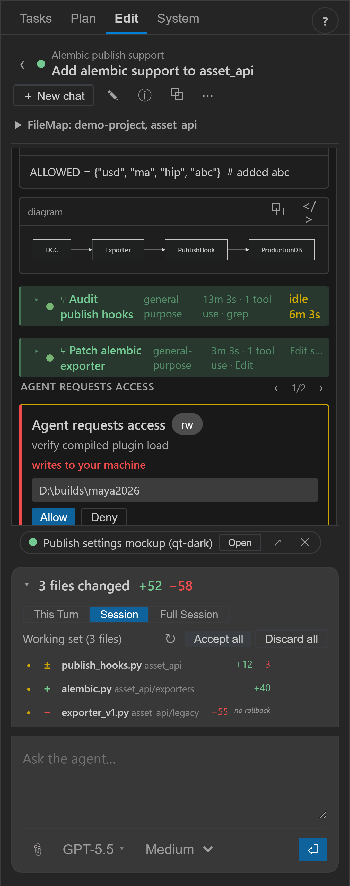
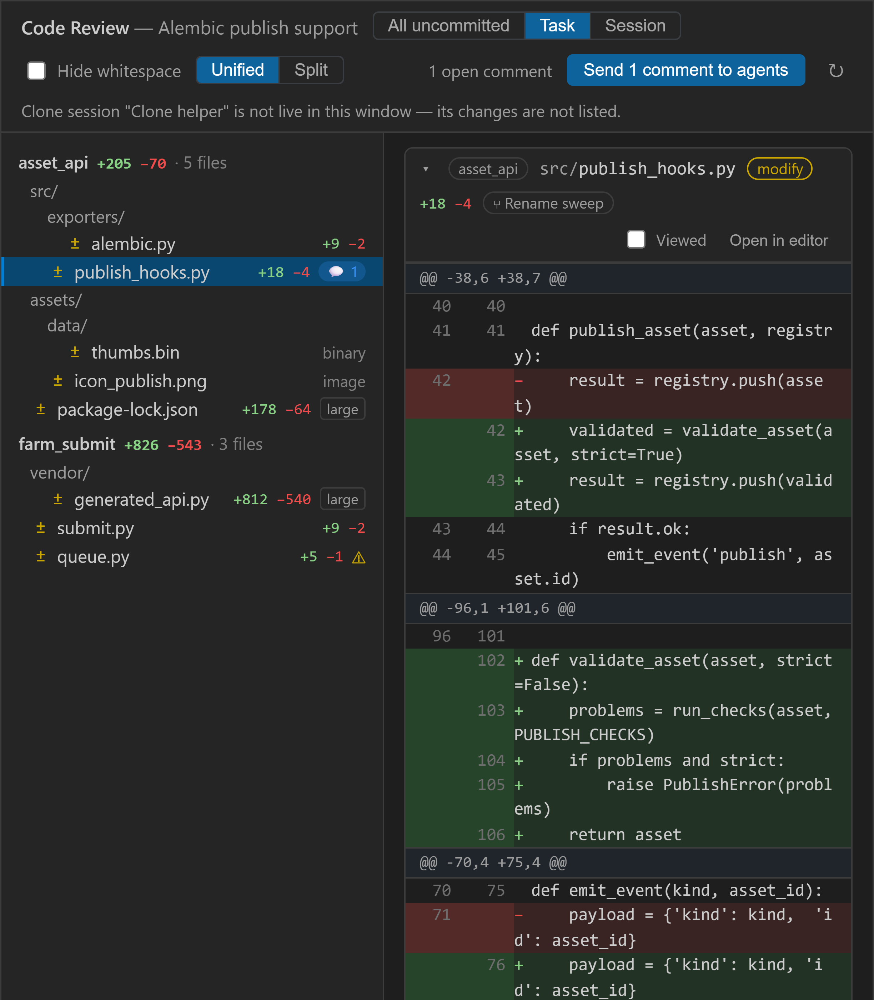
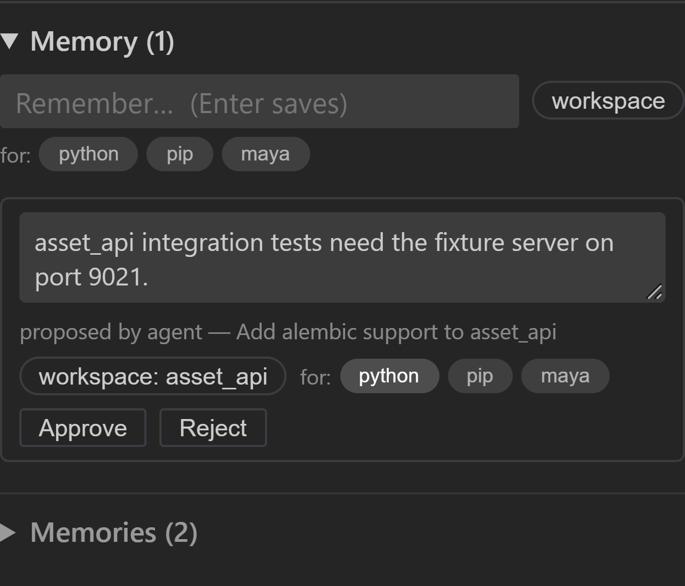
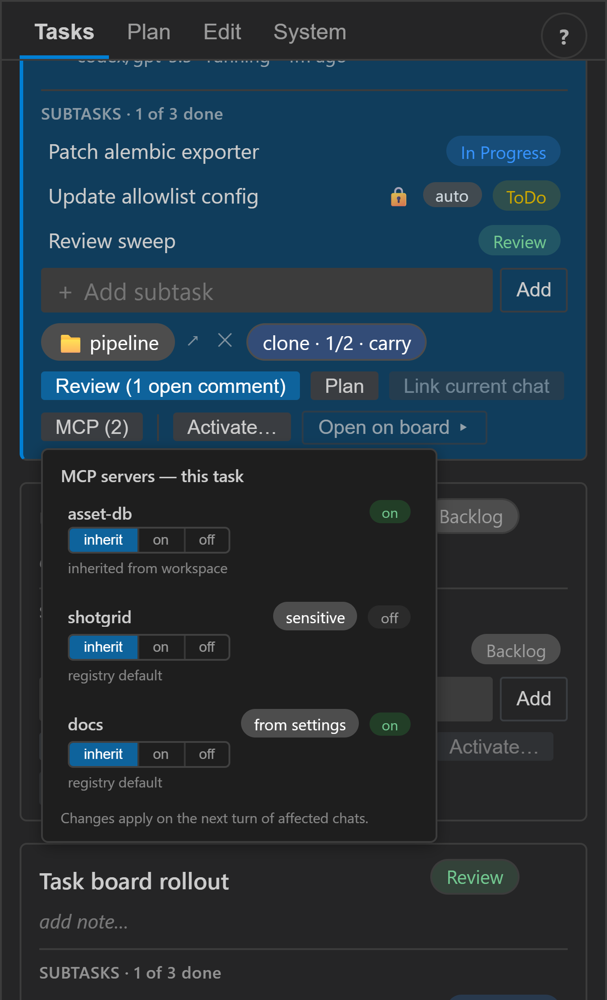
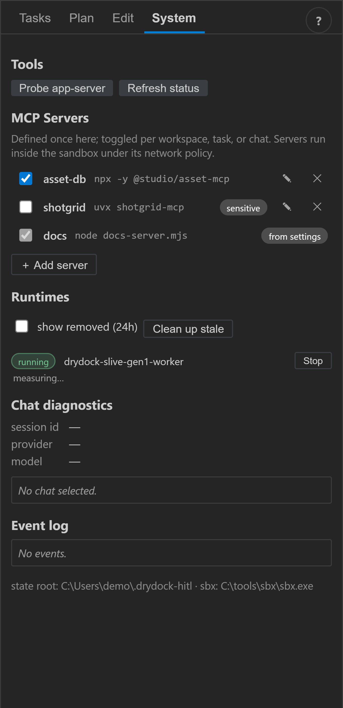

# Drydock - the engineering AI workbench

> **Note:** Drydock is currently an AI-generated prototype experiment. It is an
> attempt to solve the compliance boundary for AI-assisted development in VFX -
> letting coding agents do real work without ever touching what they shouldn't.
> Use in production is at your own risk. Contributions welcome.

A security-first VS Code extension for running coding agents you can trust
with real work: every agent executes inside a **disposable isolated runtime**
(Docker Sandbox), reaches the host **only through explicitly approved
mounts**, and everything it does is **visible, attributed, and reviewable**
before anything ships. The vessel comes into the dock, the work happens in
isolation, and nothing launches until you release it.

## What it looks like

Tasks are the unit of work: chats, subtasks, workspace links, and clone policy
on one card. The inbox strip at the top collects everything waiting on you.



The Edit tab is a chat against a sandboxed agent: subagent rows, access-request
cards with typed confirmation for writes, live preview servers, and an
evidence-based changed-files list with accept/discard.



Code Review aggregates every changed file across a task's projects - text
hunks, image/binary deltas, large-diff collapsing, selection comments routed
back to the owning agents. It never commits.



Team memory is scoped (global / workspace / task) and tagged by what's in the
workspace (`*.py` → python, `package.py` → rez, …). Quick-add is one line;
agent proposals are editable before approval - nothing an agent writes
persists without a human clicking Approve.



MCP servers are defined once (System tab) and toggled per workspace, task, or
chat with inherit/on/off; sensitive servers need an explicit task/chat opt-in.
The effective set is written into the sandbox and applies next turn.





## What it does

- **Contained sessions** - one isolated runtime per chat; Codex (app-server /
  exec-json) and Claude Code transports; model/provider switching mid-session.
- **Blast-radius approvals** - agents request host paths via a strict fenced
  protocol; risk-tiered cards (typed confirm for rw/sensitive), default-denied
  credential roots, per-session grants ledger.
- **Studio guardrails** - an OS-managed policy can cap AI project roots,
  require clone-only work, omit sensitive repo paths, and enable networked AI
  only on allocated workstations; personal settings may narrow it further.
- **Work management** - tasks linking sessions + workspace sets, live
  workspace switching, multi-window awareness.
- **Scoped team memory** - global/workspace/task memories with glob-rule tags
  detected from the mounted folders; user quick-add plus agent proposals that
  are edited and approved by a human before they persist.
- **MCP registry** - servers defined once, toggled per workspace/task/chat
  through a tri-state cascade; sensitive servers gate on explicit opt-in; env
  values never render in the UI.
- **Working set & review** - per-file diff baselines with accept/discard,
  cross-project **Code Review** (comments → revision turns; never commits).
- **Clone mode** - full-clone sandboxes with a 3-way patch sync (pull/push),
  for work that must never mount live folders.
- **Subagent visibility** - native fan-outs (Codex collab agents, Claude
  Tasks) render as collapsible transcript groups and a `[Log | Agents]`
  hierarchy lens with per-agent status, files, and token usage.
- **Role sessions** - spawn researcher/planner/worker/tester/reviewer children
  from a live chat; children can never exceed the parent's access.
- **Attention stack** - agent questions and access requests share one paged
  card slot (question + recommended answers + free-text), wired to badges and
  toasts.
- **Context debug** - chat ⋯ → Context debug opens a markdown doc showing
  exactly what the next briefed turn carries (mounts, memories, MCP set,
  instructions), each section annotated with where it came from.

## Repository layout

```
apps/vscode-extension/   extension host + webview UI (hand-rolled DOM, strict CSP)
packages/contracts/      shared types, event model, webview envelope, agent tree reducer
packages/core/           services: sessions, mounts, questions, review, clone sync
packages/agent-adapters/ codex + claude transports and stream normalizers
packages/runtime-adapters/ docker-sandbox runtime adapter
packages/storage-sqlite/ durable stores (sessions, events, tasks, questions, …)
packages/work-management/ tasks, workspace sets, memory, MCP registry
tools/webview-harness/   browser harness for the real webview bundle (visual tests)
tools/prevalidate/       environment + provider capability gate
docs/adr/                architecture decision records (start here)
docs/design/             architecture & design docs: implementation plan, threat model, workflows, roadmap
```

## Build, test, run

```
npm install
npm test                      # tsc -b + full node:test suite
npm run prevalidate           # environment/provider capability gate
cd apps/vscode-extension && npm run bundle        # esbuild the extension + webview
cd apps/vscode-extension && npm run package:vsix  # installable VSIX
node tools/webview-harness/server.mjs             # visual harness on :8971
```

The screenshots above come from that harness - the real webview bundle against
a mock host with dummy fixtures, no docker or providers needed.

## Reading order

1. [docs/adr/](docs/adr/README.md) - the decisions that shape the product.
2. [docs/design/roadmap.md](docs/design/roadmap.md) - what's shipped and what's next (see the [design docs index](docs/design/README.md) for the rest).
3. [docs/design/threat-model.md](docs/design/threat-model.md) - what we defend against and what we deliberately don't.
4. [docs/design/studio-security-policy.md](docs/design/studio-security-policy.md) - managed project, clone, omission, and machine-allocation controls.
5. [docs/design/workflow-scenarios.md](docs/design/workflow-scenarios.md) - day-in-the-life flows + the B4 friction rule.

## License

[MIT](LICENSE).

Status: VSIX-only pre-release. The capability set above is implemented and
covered by the automated test suite; external provider support and remote
execution remain roadmap work.
