# Drydock demo

A quick visual tour of every Drydock surface, rendered with the built-in demo data — the same local fixtures the guided tour uses. Demo data stays inside the panel: no files, agents, or runtimes are touched.

Every panel has a `?` help centre with a spotlight tour. Starting a tour switches the panel to demo data (the tour's Data menu can restore Live):

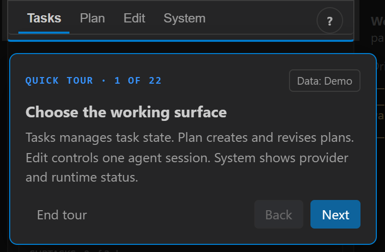

The rest of this page shows the panels with demo data active but no tour running.

## Tasks (sidebar)

The Tasks tab is the home surface: create tasks, move them through stages with the column pill, and manage each task's subtasks, linked chats, review, and plan from one card.

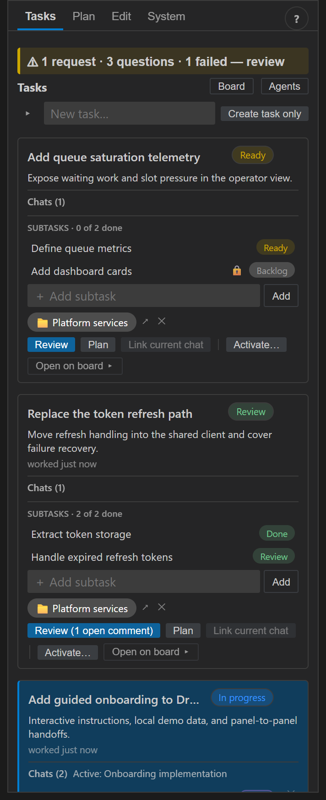

### The lead's inbox

Everything that needs a human decision lands in one summary line: access requests, agent questions, failed chats, human-verify gates, parked runs, and unlanded changesets. Expand it to work the queue — questions and access cards page one at a time, and the inbox rows below act inline (stamp **Verified ✓**, **↻ Retry** a parked run) or jump to the right surface.

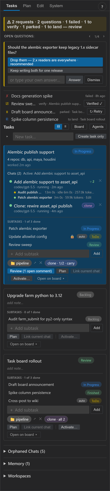

Session dots across the panel show running-a-turn (pulsing) vs idle-live on every row, so "is it done, failed, or waiting on me?" is answered at a glance.

### Workspaces

The Workspaces section defines named groups of registered folders, each member optionally read-only. Tasks link to a workspace, and Activate opens that context for new chats.

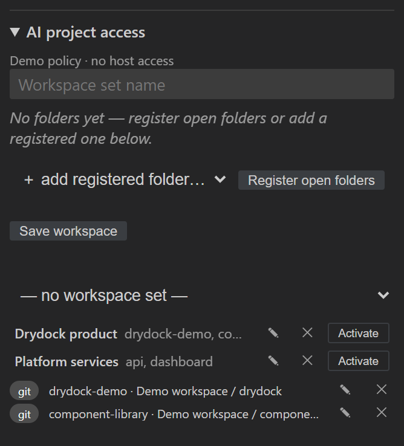

## Task Board

The board panel shows tasks and subtasks across configurable columns with dependency connections, lock/queued/running states, and verification chips. Recipes materialize a task with a preset subtask chain; filters, detail level, and lanes tune density.

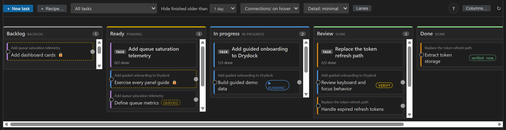

## Planning

The Plan tab drives the planning conversation: pick or create a plan, assign the owning task, choose aspects, and add read-only context.

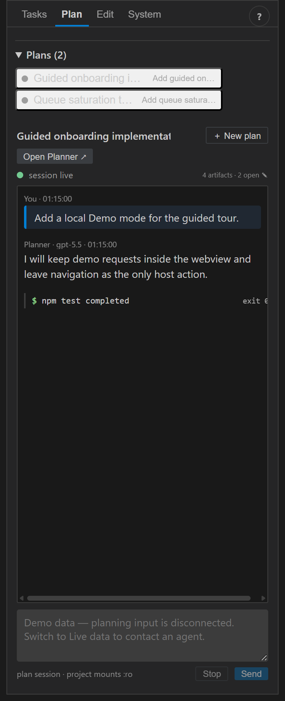

The Planner panel shows the plan's files by aspect. Markdown documents render with an outline and inline notes; the notes queue on the right collects annotations to delegate back to the planning session, and `⇪ To board…` turns the plan's checklists into subtasks.

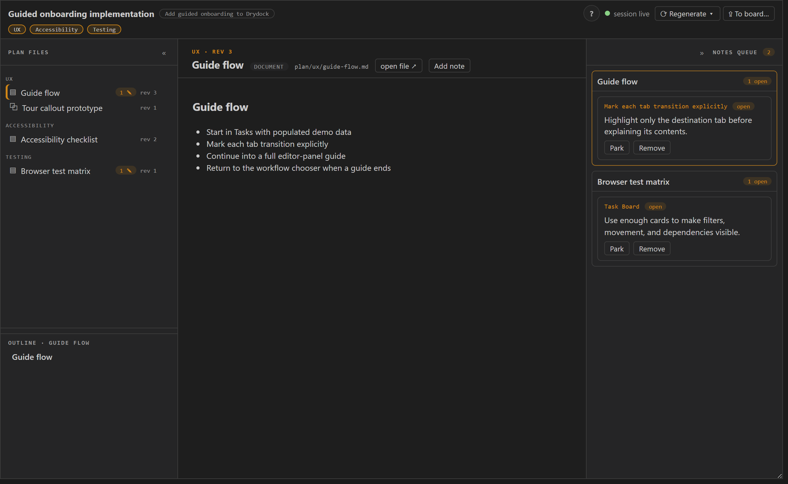

HTML prototype artifacts render in a sandboxed frame with Preview and Annotate modes — buttons actually click in Preview, notes anchor to page regions in Annotate, and inline scripts stay inert until the per-artifact `scripts` toggle opts in.

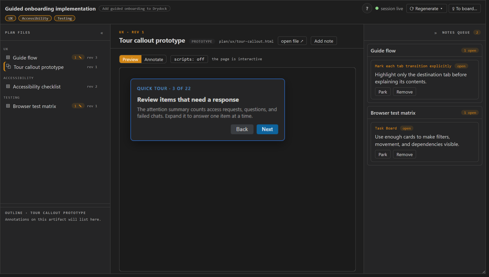

## Editing

The Edit tab controls one implementation session: transcript with subagent activity, tool and command results, access requests and questions inline, sandbox stats, and a composer with model selection.

Paste a screenshot or attach images/documents (📎) directly in the composer — and in question answers: files upload into the running sandbox at `/workspace/attachments/` over the runtime's own transport (works for remote runtimes too), so the agent can open them immediately with no mount changes or restart. Attachments reference as `[file:…]` tokens in the prompt.

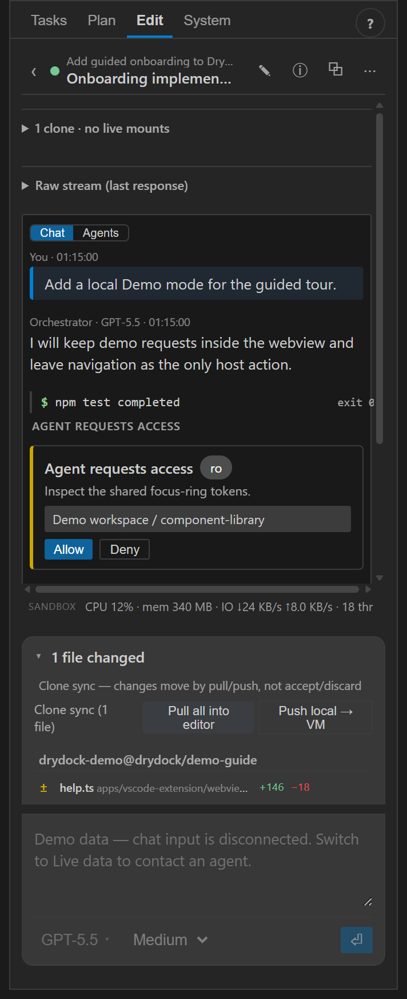

### Clone workflow

Clone-mode sessions work on an isolated clone of the repository. The changes tray shows the clone's branch and touched files; changes move explicitly by Pull all into editor / Push local → VM rather than accept/discard.

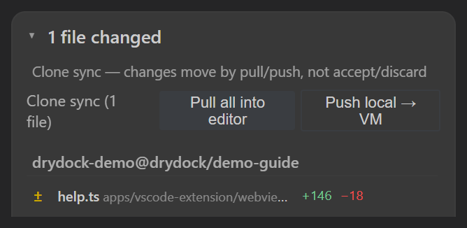

**Export patch…** saves the clone's captured changeset as a `.patch` file to carry between machines; on the receiving machine, `Drydock: Apply Patch to Folder…` applies it to an open repo with a three-way merge — human-confirmed, never committed or pushed.

### Human-in-the-loop testing

Agents run in isolated containers, so checks that need a display, a DCC, or a human judgement (a Maya scene, tour keyboard behavior) can't run agent-side. Instead the agent posts step-by-step instructions in the transcript and raises a question: you run the steps, then answer with a one-click result option or your own feedback, and the agent continues from that. Subtasks gated on human verification keep a `VERIFY` chip on the board (visible above) until you stamp them Verified.

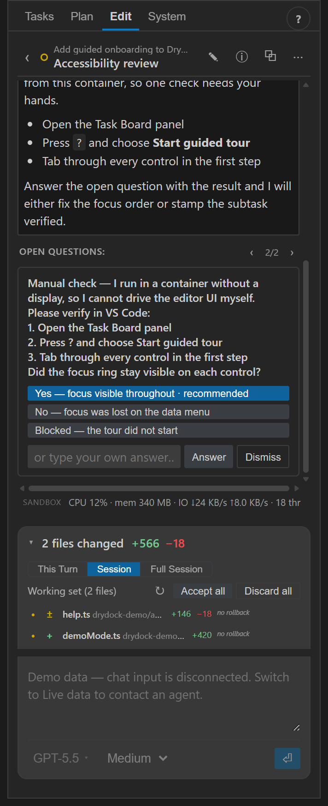

## Agents

The Agents panel is the fleet view: every session grouped by task with live activity, subagent rows, attention chips, and verification warnings. The Landing drawer lists unlanded changesets, ordered disjoint-first with overlap warnings, each one a two-click Pull.

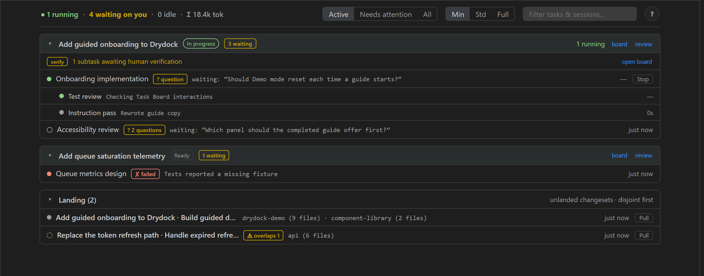

## Task Review

Task Review collects a task's changed files across sessions and projects (clone changes included), with per-file comment threads. Open comments dispatch back to the responsible sessions in one send.

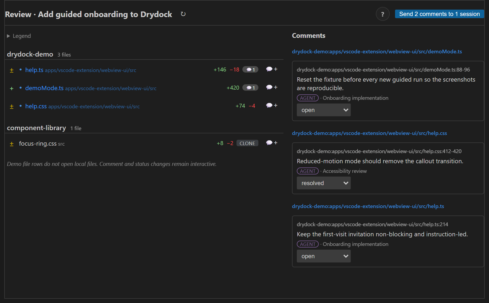

## Code Review

The Code Review panel is the PR-style read over the same data: a scope seg (All uncommitted / Task / Session), a navigator with compressed folder trees, and every diff inline — images before/after, binary byte deltas, large files collapsed, whitespace and unified/split toggles. Select code to comment: the box follows your last selection, stacks multiple ranges into one note, and **Comment** sends the file + lines back to the owning agent. (Captured from the harness fixtures; open via `Drydock: Open Code Review`.)

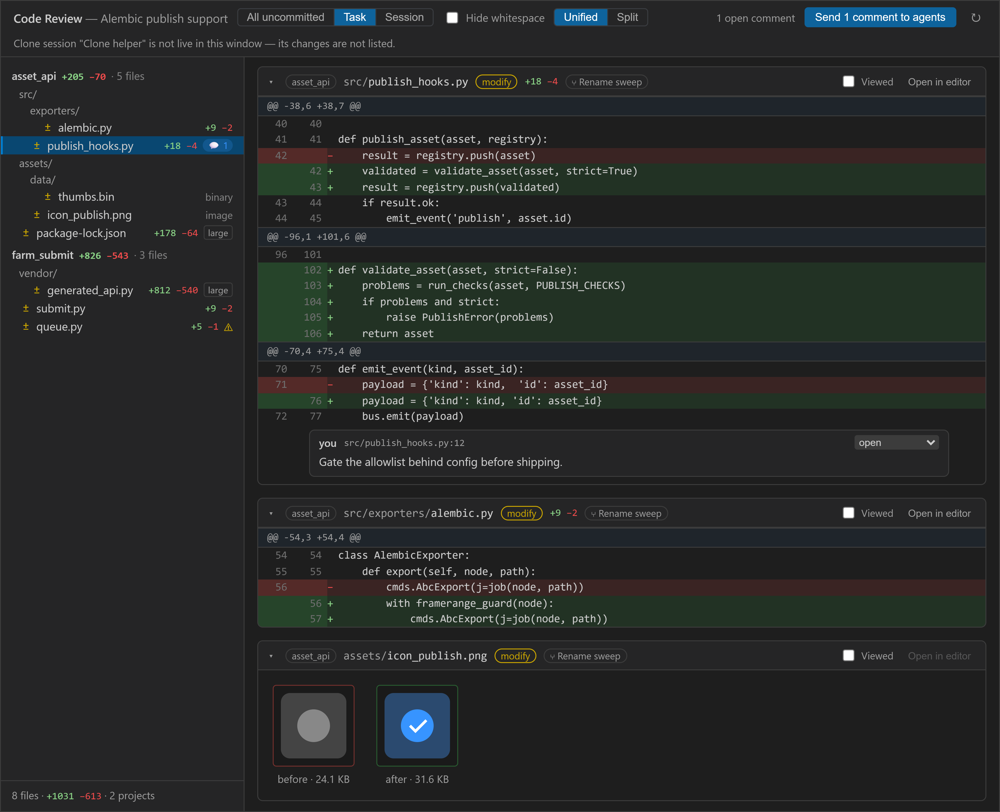

## System

The System tab covers runtime inventory and testing controls: probe the app-server, inspect and stop runtimes, clean up stale ones, and read per-session chat diagnostics and the event log.

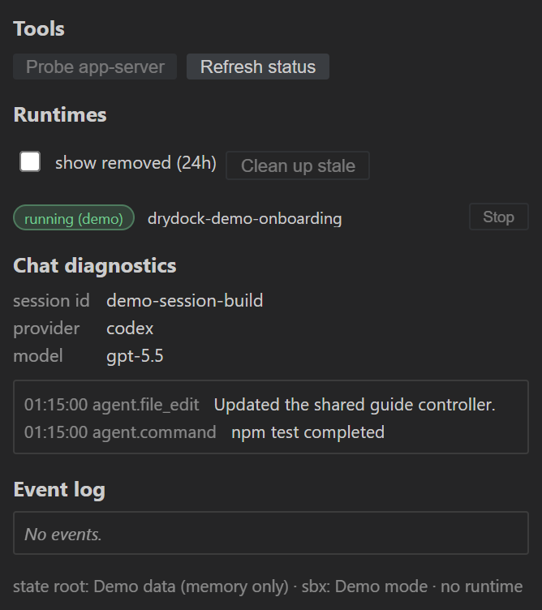

---

To try it yourself: open any Drydock panel and press `?` → **Start guided tour**, or serve the webview harness (`npm run bundle` in `apps/vscode-extension`, then `node tools/webview-harness/server.mjs`). All screenshots were captured from the harness with demo data active.
