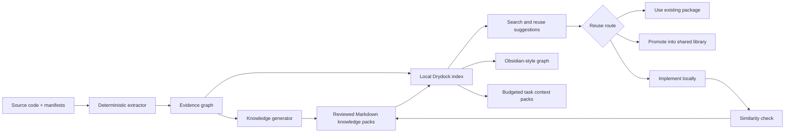

# Cross-Project Knowledge Atlas

## Status

Idea for later exploration. This document is not an accepted architecture decision or implementation commitment.

Updated after an external research pass on 2026-07-11 covering agent instruction files, repository maps, code-intelligence graphs, developer portals, component catalogs, duplication detection, and recent repository-graph research.

## Problem

When agents work across many projects, they repeatedly spend tokens rediscovering architecture, public APIs, and existing solutions. The same capabilities can then be implemented more than once, both within a project and across projects.

The goal is to give every project a small, version-controlled knowledge pack and let Drydock build a searchable, Obsidian-like cross-project view over those packs. Agents should receive a small, relevant reuse shortlist rather than rereading entire repositories.

## Recommended model

Separate three kinds of knowledge:

1. **Project knowledge** - what the project is and how it works.
2. **Reusable API knowledge** - code another project can safely consume.
3. **Workflow knowledge** - how capabilities across several projects combine to accomplish something.

This should remain distinct from Drydock's existing reviewed memory system. Current memory is short briefing context; it is not a structured, versioned API catalog.

The Atlas should have two complementary layers:

1. **Evidence graph** - deterministically extracted projects, packages, exports, imports, references, tests, build targets, and consumers.
2. **Reviewed knowledge graph** - human-readable responsibilities, workflows, ownership, stability, usage guidance, and approved similarity or supersession relationships.

Markdown is the portable, reviewed human projection of this knowledge. It is not the whole database and should not be required to duplicate facts that can be extracted reliably from code.



## Repository knowledge pack

Use a consistent directory in every registered project:

```text
.drydock/
  knowledge/
    project.md
    architecture.md
    components.md
    api/
      component-or-module.md
    workflows/
      workflow-name.md
```

Avoid generating one file for every trivial function. Generate API pages by public module, component family, service, or package, with individual functions listed inside.

### `project.md`

A deliberately short entry point containing:

- Purpose and boundaries
- Primary languages and frameworks
- Key capabilities
- Package or application layout
- Entry points
- Data and external systems
- Build, test, and run commands
- Links to architecture, APIs, and workflows

Target roughly 500-1,000 words.

### `architecture.md`

- Mermaid component or dependency diagram
- Runtime boundaries
- Dependency direction
- Data ownership
- Important architectural constraints
- Extension points
- Links to ADRs rather than duplicated ADR content

### `components.md`

A compact catalog containing:

- Component or module name
- Short responsibility
- Public or internal status
- Stability level
- Source path
- Package or import name
- Links to detailed API pages
- Known consumers

### `api/*.md`

Only reusable public surfaces belong here:

- Stable knowledge ID
- Export and package name
- Responsibility
- Public types, functions, or components
- Inputs, outputs, errors, and side effects
- Minimal usage example
- Dependencies and platform constraints
- Stability: experimental, supported, or deprecated
- Version or commit last verified
- Tests demonstrating expected behaviour
- "Use when" and "do not use when"
- Similar or superseded APIs

Example frontmatter:

```yaml
---
id: drydock.core.session-diff-service
kind: service
project: drydock
package: "@drydock/core"
source: packages/core/src/sessionDiffService.ts
export: SessionDiffService
stability: supported
visibility: public
tags: [diff, review, workspace]
verified_commit: abc1234
---
```

Stable IDs are essential. Paths and names will change; graph links should not break when they do.

### `workflows/*.md`

A workflow describes an outcome spanning projects:

```yaml
---
id: workflow.review-and-release
kind: workflow
projects: [frontend, api, shared-contracts]
owner: platform
---
```

Each workflow should contain:

- Trigger and desired outcome
- Preconditions
- Ordered steps
- Project responsible for each step
- APIs or components used at each boundary
- Data passed between projects
- Failure and recovery paths
- Mermaid sequence or flow diagram
- Tests or commands that verify the whole workflow

## Generation strategy

The generator should be deterministic first and AI-assisted second.

### Extract without AI

Use language-aware tooling to collect:

- Workspace and package manifests
- Public exports
- TSDoc or JSDoc
- Type signatures
- Import and dependency relationships
- Entrypoints
- Test references
- Existing README and ADR links
- Git commit and content hashes

For TypeScript, package exports, index modules, TSDoc, and the TypeScript compiler API can provide most of the reusable API catalog without an AI call.

The extracted result should be stored as a rebuildable evidence graph. Every edge should retain its evidence, such as the import, manifest entry, compiler reference, test declaration, or build configuration that created it. This lets the UI explain relationships and prevents generated prose from becoming the source of truth for code structure.

### Use AI selectively

AI should only:

- Summarize architecture when structural inputs changed
- Explain non-obvious responsibilities
- Suggest relationships or reuse candidates
- Draft workflow narratives
- Identify probable semantic duplication

Cache every generated section using hashes of its source inputs. If neither code nor relevant documentation changed, reuse the previous result. Generated text should be proposed as a diff and reviewed before becoming trusted knowledge.

AI-inferred relationships such as `similar-to`, architectural responsibility, or a probable workflow connection should remain suggestions until reviewed. Deterministic and inferred edges must be visually and structurally distinguishable.

## Cross-project index

Do not make one central repository the source of truth. Each project owns its committed Markdown and code metadata. Drydock maintains a rebuildable local projection in its state store:

- Project records
- Knowledge document metadata
- Full-text search index
- Symbols and reusable components
- Links between projects, components, workflows, and tasks
- Source hashes and stale status
- Usage and consumer relationships
- Possible duplicate clusters

This can extend the existing project catalog and `WorkspaceSet` model.

Search should begin with local full-text ranking such as BM25 over names, tags, descriptions, signatures, examples, and source paths. Semantic or embedding search can be added later for differently worded capabilities, but it should complement rather than replace exact symbol and metadata search.

The index should expose small neighbourhood queries-for example, a selected API plus its direct consumers, tests, owner, workflows, and alternatives-rather than serializing the complete graph into an agent prompt.

## Visualization

Add an editor-area **Atlas** or **Knowledge** panel with three coordinated views:

- **Explorer:** projects → components → APIs → workflows
- **Graph:** relationships and cross-project dependencies
- **Detail:** rendered Markdown, source links, consumers, freshness, and reuse instructions

Useful node types:

- Project
- Package or module
- Public component or API
- Workflow
- External system
- Task
- Duplicate candidate

Useful edges:

- `exports`
- `depends-on`
- `uses`
- `implements-step`
- `consumed-by`
- `similar-to`
- `supersedes`
- `owned-by`
- `changed-by-task`

Graph filters matter more than visual spectacle. Default to the immediate neighbourhood of the selected node; a graph of every function in every repository will become unusable.

Drydock can reuse its existing Planner Markdown and Mermaid rendering foundation.

The Atlas must drive product actions rather than exist as a passive portal. From a node, users should be able to search consumers, inspect evidence, open source, identify affected projects, add relevant context to a task, compare alternatives, or create a reuse/extraction subtask. A visually impressive graph that is disconnected from daily task and review flows is unlikely to remain useful.

## Agent reuse workflow

Before an implementation session:

1. Resolve the task's projects and workspace set.
2. Search the catalog using the task title, description, requested types, and active file.
3. Inject only a short reuse shortlist into the briefing.
4. Let the agent open detailed API pages or source files on demand.
5. Require the implementation plan to state whether it will reuse, extend, promote, or create a capability.

The initial context pack should have a hard budget-approximately 1,000-2,000 tokens-and normally contain no more than three to five candidates. Each candidate should include only its responsibility, stability, compatibility, import path, reason for ranking, and links for deeper retrieval. Agents can request API details, examples, consumers, or source on demand.

During review:

- Detect newly exported APIs not represented in the knowledge pack.
- Compare new functions and components against indexed reusable APIs.
- Flag likely duplication as review information, not an automatic failure.
- Offer "extract shared capability" as a follow-up subtask.

This reduces token use because agents receive a small ranked catalog rather than entire repositories.

## Reuse policy

Cross-project reuse should not silently become copy-and-paste reuse. Prefer this order:

1. Reuse within the same module.
2. Reuse through an existing public package.
3. Extend an existing public package.
4. Promote duplicated, stable behaviour into an approved shared library.
5. Copy only when projects must remain independent, recording provenance and divergence expectations.

A reusable entry should not be marked `supported` until it has:

- A public export
- Tests
- Documentation
- An owner
- A compatibility or versioning policy
- No dependency on private application state

## Duplication controls

Use two complementary checks:

- **Structural duplication:** token or AST similarity for copied implementations.
- **Semantic duplication:** catalog and search comparison for differently written code serving the same purpose.

Start with reporting only. Establish baselines before introducing CI thresholds, otherwise legacy duplication will overwhelm the useful signal.

Within-project duplicate checking should run on changed files. Cross-project checking should query the central index rather than rescan every repository during every task.

## External approaches and lessons

An external research pass found no single dominant solution. The strongest systems combine several narrower techniques.

### Thin, scoped agent instructions

Claude Code recommends concise `CLAUDE.md` files, imported reference documents, and path-scoped rules that load only when relevant. Cursor similarly supports always-loaded, path-attached, and agent-requested project rules. Community discussions consistently warn that a large always-loaded instruction file consumes context and becomes harder for agents to follow.

Implication: `project.md` should be a short index and orientation document. Detailed APIs and workflows should be retrieved on demand, not injected into every session.

References:

- [Claude Code: How Claude remembers your project](https://code.claude.com/docs/en/memory)
- [Cursor project rules](https://docs.cursor.com/context/rules)
- [Reddit: Keeping context on larger projects](https://www.reddit.com/r/ClaudeAI/comments/1szckuo/keeping_context_on_larger_projects/)
- [Reddit: Context bloat with CLAUDE.md](https://www.reddit.com/r/ClaudeAI/comments/1rps19b/context_bloat_with_claudemd_how_are_people/)

### Token-budgeted repository maps

Aider constructs a dependency graph, ranks important files and identifiers, and selects the most relevant portion that fits a configurable token budget. The model can then request specific files.

Implication: the human Atlas and the agent context projection should be separate products. The latter should be dynamically ranked and intentionally small.

Reference: [Aider repository map](https://aider.chat/docs/repomap.html)

### Deterministic project and code-intelligence graphs

Nx calculates project and task graphs from source and build configuration, uses them for affected-project and execution decisions, and provides focused graph navigation with traceable edges. Sourcegraph's SCIP-backed navigation uses compiler information for cross-repository definitions, references, and implementations.

Implication: important graph relationships must be extracted from code and retain their evidence. Full-graph visualization should default to focused neighbourhoods and composite nodes.

References:

- [Nx project graph](https://nx.dev/docs/features/explore-graph)
- [Sourcegraph code navigation](https://sourcegraph.com/docs/code-navigation)
- [SCIP code intelligence protocol](https://github.com/sourcegraph/scip)

### Repository-owned software catalogs

Backstage stores catalog metadata alongside code and harvests it into a central view containing software, ownership, documentation, APIs, and relationships. Its API model explicitly represents APIs provided and consumed by components.

User reports show that this works at thousands-of-repositories scale, but they also warn that a heavily customized Backstage deployment can require dedicated platform engineers and that the portal UI may see limited use.

Implication: follow the repository-owned metadata pattern, but keep Drydock's implementation local and task-oriented. Do not turn the Atlas into a general-purpose internal developer portal.

References:

- [Backstage Software Catalog](https://backstage.io/docs/features/software-catalog/)
- [Backstage catalog relations](https://backstage.io/docs/features/software-catalog/well-known-relations/)
- [Reddit: Backstage use cases and operational experience](https://www.reddit.com/r/devops/comments/1ldjjcu/whos_using_backstage_what_are_your_use_cases/)

### Reusable component catalogs and packages

Storybook makes UI components discoverable, documented, testable, and inspectable in isolation. Bit treats reusable components as versioned units with dependencies, API documentation, previews, tests, graph visualization, and package distribution.

Community discussions generally favour monorepo workspace packages or versioned private packages for actual reuse. They also note that shared libraries add compatibility, release, and multi-repository coordination costs.

Implication: the Atlas should discover reuse opportunities, but supported reuse must still happen through a versioned package, component, or service contract. Documentation must not normalize copying source between projects.

References:

- [Storybook component documentation](https://storybook.js.org/docs/8/get-started/browse-stories)
- [Bit component model](https://bit.dev/reference/components/the-bit-component/)
- [Reddit: When to make a library shared](https://www.reddit.com/r/ExperiencedDevs/comments/uu81o6/when_is_it_appropriate_to_make_a_library_shared/)

### Duplication detection

Tools such as jscpd and SonarQube detect structural copy/paste duplication. This is useful and inexpensive, but it does not reliably find independently written code that performs the same business function.

Implication: use structural duplicate detection on changed files and semantic catalog comparison for capability-level duplication. Begin with review information rather than CI failure.

Reference: [jscpd documentation](https://jscpd.dev/getting-started/introduction)

### Recent repository-graph research

Recent research is converging on persistent, queryable repository graphs:

- RepoDoc constructs a repository knowledge graph, clusters code into coherent modules, and incrementally generates cross-referenced documents and Mermaid diagrams.
- Repository Intelligence Graph builds a deterministic, build-and-test-centred architectural map. Its authors report improved accuracy and reduced completion time across their evaluation, though this is one research result rather than broad production evidence.
- Codebase-Memory constructs persistent Tree-sitter graphs and exposes call-graph and impact queries through MCP.
- RepoGraph adds a graph-search action to agents so they can retrieve a small relevant neighbourhood instead of repeatedly searching directories and files.

Implication: graph construction and small-subgraph retrieval should be foundational; automatic prose generation is a projection over that foundation.

References:

- [RepoDoc](https://arxiv.org/abs/2604.26523)
- [Repository Intelligence Graph](https://arxiv.org/abs/2601.10112)
- [Codebase-Memory](https://arxiv.org/abs/2603.27277)
- [RepoGraph](https://arxiv.org/abs/2410.14684)

## Rollout plan

### Phase 1 - Convention and pilot

- Define the Markdown and frontmatter schema.
- Hand-author or generate packs for Drydock and two contrasting projects.
- Validate that engineers and agents can find reusable code faster.
- Decide naming, stability, ownership, and staleness conventions.
- Measure the current tokens and time spent rediscovering project structure to establish a baseline.

### Phase 2 - Deterministic generator

- Extract project structure, package exports, signatures, docs, and tests.
- Generate stable Markdown with protected manual sections.
- Update only documents whose input hashes changed.
- Add a `check` mode that reports stale knowledge without rewriting it.
- Persist evidence for every extracted node and edge.

### Phase 3 - Local catalog and search

- Index every registered project.
- Add full-text and tag search.
- Rank by compatibility, stability, workspace relevance, and freshness.
- Generate compact task context packs.
- Enforce a context budget and support deeper on-demand retrieval.
- Integrate the reuse shortlist into task start before building the graph UI.

### Phase 4 - Atlas visualization

- Add project, component, and workflow graph views.
- Add source navigation and backlink or consumer panels.
- Show stale, unsupported, duplicated, and high-reuse nodes.
- Reuse the existing Planner Markdown and Mermaid rendering stack.

### Phase 5 - Workflow intelligence

- Add explicit workflow records and cross-project sequence diagrams.
- Link workflows to tasks and task review.
- Show impact when an API used by several workflows changes.

### Phase 6 - Reuse and duplication gates

- Add changed-file similarity checks.
- Suggest existing APIs before new implementation.
- Track accepted, rejected, and false-positive suggestions.
- Introduce narrowly scoped CI policies only after measuring accuracy.

## Success measures

Track outcomes rather than document volume:

- Percentage of tasks where an existing component was discovered
- Reuse suggestions accepted
- Duplicate implementations avoided or consolidated
- Average context tokens per task
- Knowledge pages opened versus injected
- Stale-document rate
- Public APIs with tests, owner, and usage example
- Time from task start to first useful implementation
- False-positive rate for duplicate warnings

## First valuable milestone

The graph is not the first milestone. The first useful outcome is:

> A deterministic project summary, a trustworthy reusable-API catalog, and a pre-task search that gives an agent five relevant candidates instead of mounting and rereading several repositories.

The first milestone should prove measurable reductions in discovery time and prompt tokens. The visual graph should follow once the underlying evidence, search ranking, and task integration are useful without it.
